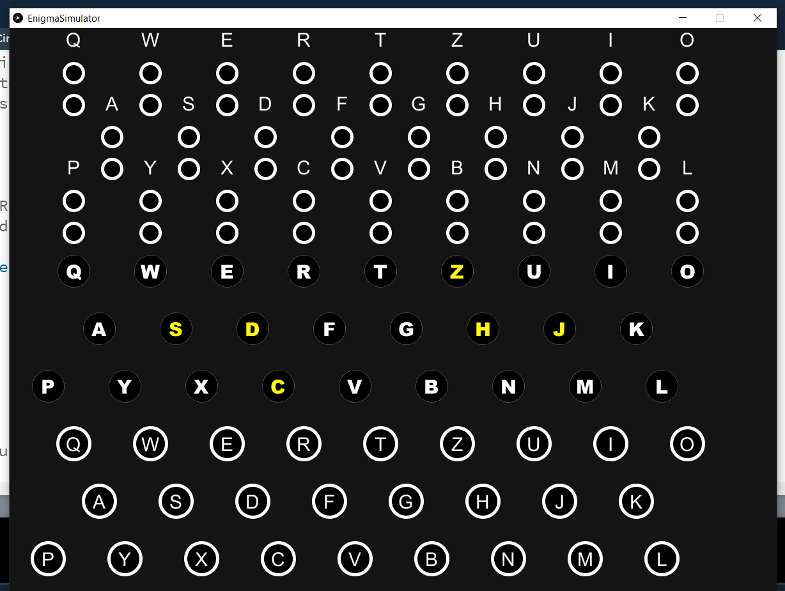

# Enigma Simulator

Repos:
  - https://github.com/miandoli/enigma-simulator
  - https://github.com/lubeskih/enigma-emulator
  - https://github.com/NationalSecurityAgency/enigma-simulator

:key: Simula a versão militar da máquina, utilizada na Segunda Guerra Mundial.

Como a máquina funciona ?

Wikipedia: https://en.wikipedia.org/wiki/Enigma_machine

HACKADAY: https://hackaday.com/2017/08/22/the-enigma-enigma-how-the-enigma-machine-worked/

NumberPhile: https://www.youtube.com/watch?v=G2_Q9FoD-oQ

Site iterativo: http://enigmaco.de/enigma/enigma.html

Universal Enigma: https://summersidemakerspace.ca/projects/enigma-machine/

Vídeo explicativo: https://www.youtube.com/watch?v=VnsTHAH5yAE

